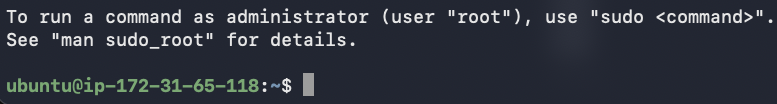
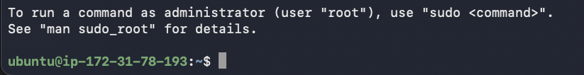

# SSH-Verbindung zu AWS EC2-Instanzen

Nach der Erstellung der zwei neuen EC2-Instanzen habe ich die SSH-Verbindungen eingerichtet.

## Vorbereitung
- Für jede Instanz ein eigenes Keypair in AWS erstellt
- Keypairs lokal in ~/.ssh/ abgelegt:
  - Nextcloud.pem (für nextcloud-server)
  - NextcloudDB.pem (für nextcloud-database)

  

## Keydatei-Berechtigungen setzen
Die Keydateien erforderten die Berechtigung 400 (nur Besitzer lesbar):

chmod 400 ~/.ssh/Nextcloud.pem
chmod 400 ~/.ssh/NextcloudDB.pem

## SSH-Verbindungen
Nach der Berechtigungsanpassung funktionieren beide Verbindungen:

ssh -i ~/.ssh/Nextcloud.pem ubuntu@<oeffentliche-IP-Nextcloud>
ssh -i ~/.ssh/NextcloudDB.pem ubuntu@<oeffentliche-IP-DB>

Beide Instanzen sind über SSH mit Ubuntu-User erreichbar.

## Tests durchgeführt
- whoami → ubuntu (Bestätigung des Users)
- uname -a → Ubuntu 22.04 LTS (Betriebssystem bestätigt)
- ls / → Dateisystem erreichbar

Verbindungen sind stabil und einsatzbereit.

### Probleme und Lösungen

Beim ersten Verbindungsversuch kam ein Fehler mit dem SSH-Key. 
Der Key war falsch konfiguriert oder der Pfad stimmte nicht.

Die Lösung war, einen neuen SSH-Key zu erstellen.

Nach der Neuerstellung des Keys funktionierte die SSH-Verbindung problemlos. 
Der neue Key wurde dann in den AWS EC2 Instanzen hinterlegt.

