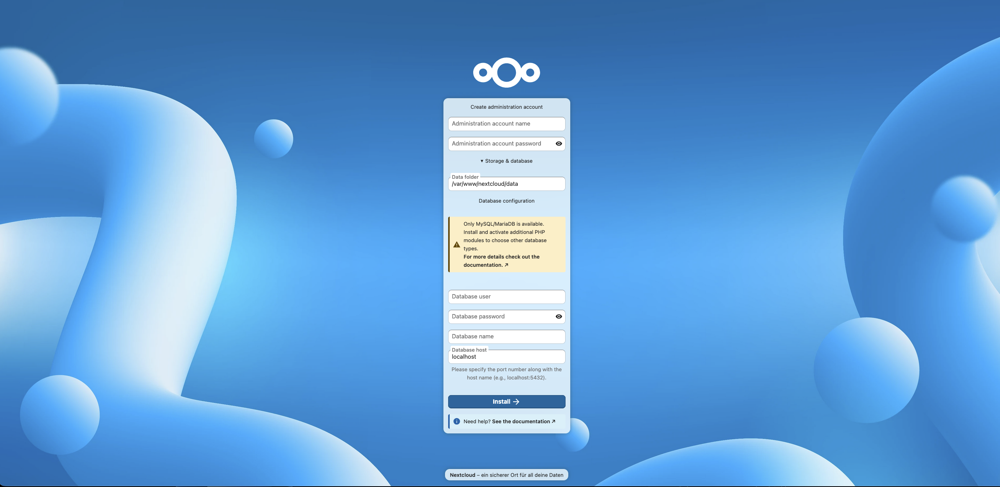
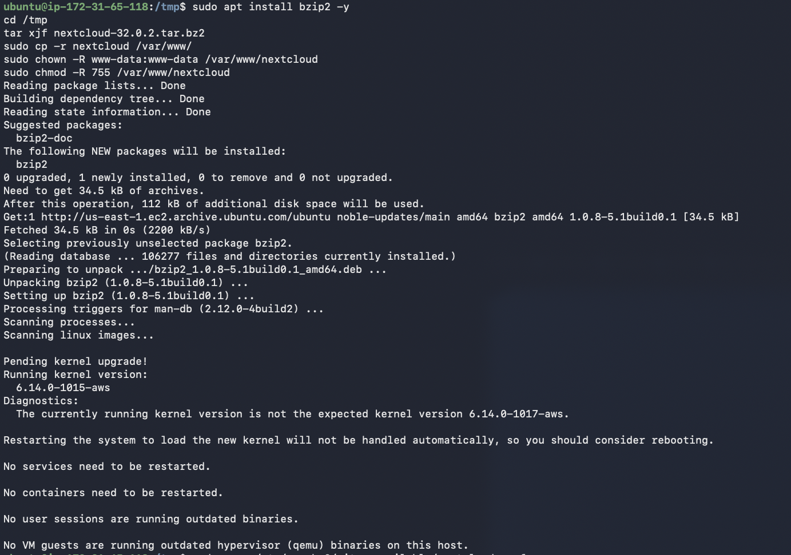

# Nextcloud-Installation auf Nextcloud-Instanz

Auf der Nextcloud-Instanz habe ich den Nextcloud-Server mit Apache und PHP installiert.

## System aktualisieren
sudo apt update && sudo apt upgrade -y

## Webserver und PHP installieren
sudo apt install apache2 libapache2-mod-php php-gd php-mysql php-curl php-mbstring php-intl php-gmp php-xml php-imagick php-zip php-apcu php-bcmath php-common bzip2 -y

## Apache Module aktivieren
sudo a2enmod rewrite
sudo a2enmod headers
sudo a2enmod env
sudo a2enmod dir
sudo a2enmod mime
sudo systemctl restart apache2

## Nextcloud herunterladen (Version 32.0.2)
cd /tmp
wget https://download.nextcloud.com/server/releases/nextcloud-32.0.2.tar.bz2
tar xjf nextcloud-32.0.2.tar.bz2
sudo cp -r nextcloud /var/www/

Download erfolgreich: 260MB in 9.5 Sekunden heruntergeladen.

## Berechtigungen setzen
sudo chown -R www-data:www-data /var/www/nextcloud
sudo chmod -R 755 /var/www/nextcloud

## Apache VirtualHost konfigurieren
sudo nano /etc/apache2/sites-available/nextcloud.conf

Inhalt der Konfiguration:
<VirtualHost *:80>
    DocumentRoot /var/www/nextcloud/
    ServerName nextcloud.local
    <Directory /var/www/nextcloud/>
        Require all granted
        AllowOverride All
        Options FollowSymLinks MultiViews
        <IfModule mod_dav.c>
            Dav off
        </IfModule>
    </Directory>
</VirtualHost>

## VirtualHost aktivieren
sudo a2ensite nextcloud.conf
sudo a2dissite 000-default.conf
sudo systemctl restart apache2

## Installation via Browser
Installation unter http://44.222.194.210 durchgefuehrt.

Konfiguration im Setup-Wizard:
- Admin-Username: admin
- Admin-Passwort: [gesetzt]
- Datenbank: MySQL/MariaDB
- Datenbank-User: nextclouduser
- Datenbank-Passwort: sicheresPasswort123
- Datenbank-Name: nextcloud
- Datenbank-Host: <IP-NextcloudDB>:3306

Nach erfolgreicher Installation ist Nextcloud ueber http://44.222.194.210 erreichbar.
Die Verbindung zur MariaDB-Datenbank auf der NextcloudDB-Instanz funktioniert einwandfrei.

### Probleme und Lösungen

Das Entpacken des Nextcloud Archives funktionierte zunächst nicht.

**Fehler:** tar: bzip2 ist erforderlich

**Lösung:**
sudo apt install bzip2 -y 
tar xjf nextcloud-32.0.2.tar.bz2

Nach der Installation von bzip2 funktionierte das Entpacken einwandfrei.

