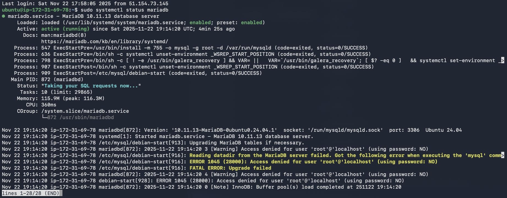
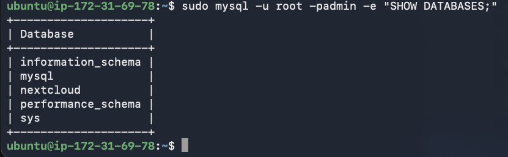
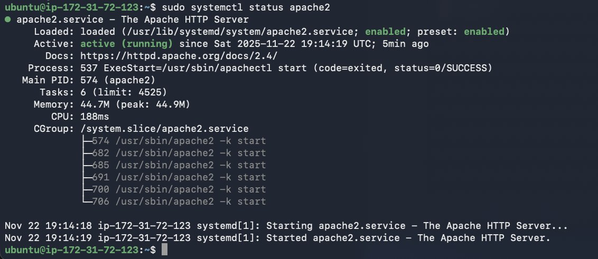
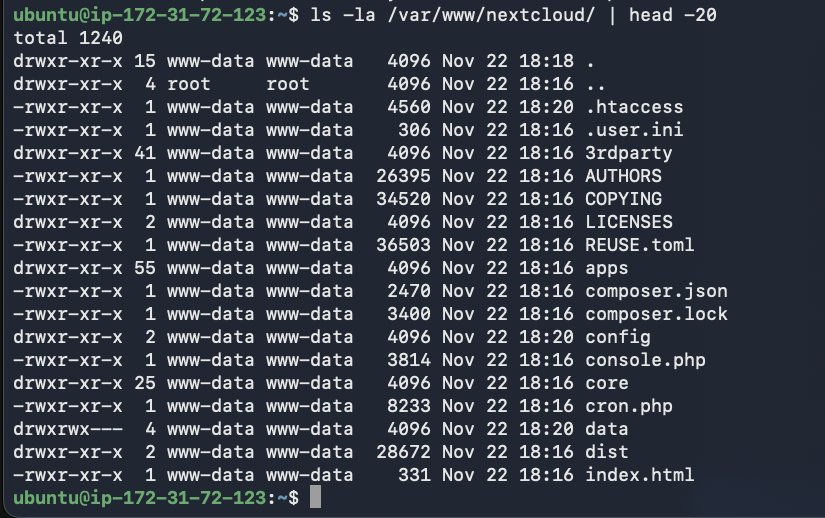
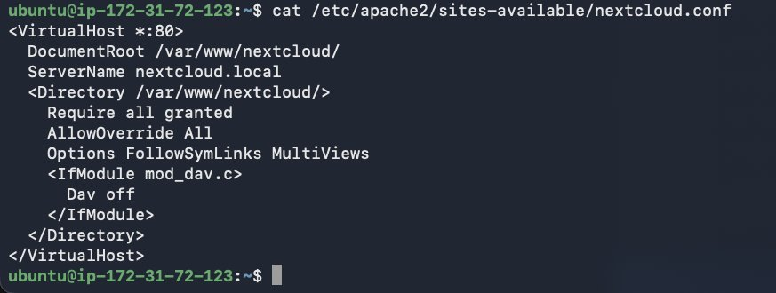
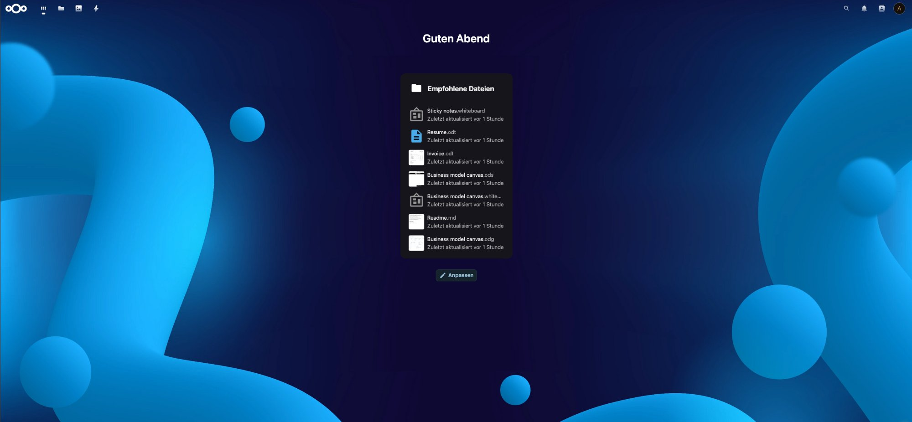

# Automatisierung - Tests und Deployment

Dokumentation des kompletten automatisierten Deployment-Prozesses mit Cloud-Init für beide EC2-Instanzen sowie die anschließende Konfiguration von Nextcloud mit Datenbank-Verbindung.

## Vorbereitung

Zwei YAML-Dateien für die automatisierte Installation wurden erstellt: cloud-init-nextclouddb.yml für den MariaDB Datenbank-Server mit automatischer Datenbank- und User-Erstellung sowie cloud-init-nextcloud.yml für Nextcloud mit Apache, PHP und VirtualHost-Konfiguration. Beide Dateien befinden sich im Repository und sind produktionsbereit.

## NextcloudDB-Instanz mit Cloud-Init erstellen und testen

Über die AWS Console wurde eine neue EC2-Instanz mit Namen NextcloudDB, Ubuntu 24.04 LTS als AMI und Instance Type t3.medium gestartet. In der Security Group wurden Port 22 für SSH und Port 3306 für MySQL geöffnet. Unter Advanced Details im User Data Feld wurde der komplette Inhalt von cloud-init-nextclouddb.yml eingefügt. Nach dem Klick auf Launch Instance läuft Cloud-Init automatisch.

Nach 2-3 Minuten Wartezeit wurde per SSH auf die Instanz verbunden und der MariaDB Status mit `sudo systemctl status mariadb` geprüft. Das Resultat zeigte MariaDB 10.11.13-MariaDB-0ubuntu0.24.04.1 mit Status active running auf Server ip-172-31-69-78 - MariaDB läuft erfolgreich. In den Logs waren einige Warnings bezüglich "Access denied for user 'root'@'localhost' (using password: NO)" und "FATAL ERROR: Upgrade failed" sichtbar, der Service selbst läuft jedoch stabil mit Status "Taking your SQL requests now...".

Die Datenbank-Prüfung mit `sudo mysql -u root -padmin -e "SHOW DATABASES;"` ergab, dass die nextcloud Datenbank automatisch erstellt wurde. Weitere vorhandene Datenbanken sind information_schema, mysql, performance_schema und sys.

Die User-Prüfung mit `sudo mysql -u root -padmin -e "SELECT User, Host FROM mysql.user WHERE User='nextclouduser';"` bestätigte, dass der User nextclouduser mit Host % für Remote-Zugriff automatisch angelegt wurde.

Installation und Konfiguration der MariaDB-Instanz waren vollständig automatisiert.

## Nextcloud-Instanz mit Cloud-Init erstellen und testen

Eine zweite EC2-Instanz mit Namen Nextcloud, Ubuntu 24.04 LTS und Instance Type t3.medium wurde gestartet. Die Security Group erlaubte Port 22 für SSH und Port 80 für HTTP. Im User Data Feld wurde der komplette Inhalt von cloud-init-nextcloud.yml eingefügt und die Instanz gestartet.

Nach 5-7 Minuten Wartezeit (Nextcloud-Download 260 MB dauert länger) wurde per SSH auf Server ip-172-31-72-123 verbunden. Die Apache Status-Prüfung mit `sudo systemctl status apache2` zeigte active running seit 2025-11-22 19:14:19 UTC mit Main PID 574 (apache2) - Apache läuft erfolgreich. Die Memory-Nutzung beträgt 44.7M und mehrere Worker-Prozesse sind aktiv.

Das Nextcloud-Verzeichnis wurde mit `ls -la /var/www/nextcloud/ | head -20` geprüft. Das Verzeichnis existiert mit allen Dateien wie .htaccess, .user.ini, 3rdparty, apps, config, core, console.php, cron.php, data, dist und index.html. Alle Dateien gehören dem User www-data:www-data mit korrekten Berechtigungen. Nextcloud wurde erfolgreich heruntergeladen und entpackt.

Die VirtualHost-Konfiguration unter /etc/apache2/sites-available/nextcloud.conf wurde mit `cat /etc/apache2/sites-available/nextcloud.conf` geprüft und zeigt die automatisch korrekt erstellte Konfiguration:
- VirtualHost auf Port 80
- DocumentRoot /var/www/nextcloud/
- ServerName nextcloud.local
- Directory-Einstellungen mit Require all granted, AllowOverride All und Options FollowSymLinks MultiViews
- Dav off für mod_dav.c Modul deaktiviert

Apache, PHP und Nextcloud wurden vollständig automatisiert installiert und konfiguriert.

## Nextcloud Setup-Wizard durchführen und mit Datenbank verbinden

Im Browser wurde die URL http://PUBLIC-IP geöffnet und der Nextcloud Setup-Wizard angezeigt. Im Setup-Formular wurde der Admin-Username admin mit Passwort NK67MxmPj7f9L4 eingegeben. Diese Credentials werden später für den Login verwendet.

Nach Klick auf "Datenbank konfigurieren" wurde im Datenbank-Formular MySQL/MariaDB aus dem Dropdown ausgewählt. Die Eingaben waren: Datenbank-User nextclouduser, Datenbank-Passwort jucbB6MPMWCzth, Datenbank-Name nextcloud und Datenbank-Host 172.31.69.78:3306. Die Private IP wurde von der NextcloudDB-Instanz ermittelt. Wichtig ist die Verwendung der Private IP, da beide Instanzen im gleichen VPC über Private IPs kommunizieren.

Nach Klick auf "Installation abschließen" dauerte die Installation 1-2 Minuten. Die Fortschrittsanzeige zeigte das Testen der Datenbank-Verbindung, die Erstellung der Tabellen, das Anlegen des Admin-Accounts und das Speichern der Konfiguration. Nach erfolgreicher Installation erfolgte automatische Weiterleitung zum Login.

## Funktionsprüfung nach Setup

Der Login mit Username admin und Passwort NK67MxmPj7f9L4 führte zum vollständig angezeigten Nextcloud Dashboard. Das Dashboard zeigt die Begrüssung "Guten Abend" sowie das Widget "Empfohlene Dateien" mit bereits vorhandenen Beispieldateien wie Sticky notes.whiteboard, Resume.odt, Invoice.odt, Business model canvas.ods, Business model canvas.whiteboard, Readme.md und Business model canvas.odg.

Die Datenbank-Verbindung wurde von der Nextcloud-Instanz aus getestet mit dem Befehl `mysql -h 172.31.69.78 -u nextclouduser -pjucbB6MPMWCzth nextcloud -e "SELECT COUNT(*) FROM oc_users;"`. Das Resultat zeigte COUNT(*) = 1 - der Admin-User existiert und die Datenbank-Verbindung zwischen den Instanzen funktioniert stabil.

## Zusammenfassung und Fazit

Die Deployment-Zeiten betrugen für die NextcloudDB-Instanz 2-3 Minuten vollständig automatisch, für die Nextcloud-Instanz 5-7 Minuten vollständig automatisch und für Setup-Wizard plus DB-Konfiguration 2-3 Minuten manuell - insgesamt 10-15 Minuten bis zur produktionsreifen Installation. Im Vergleich zur vollständig manuellen Installation wurden 45-60 Minuten gespart.

Automatisiert wurden: MariaDB Installation und Konfiguration, Datenbank nextcloud erstellen, User nextclouduser mit Berechtigungen erstellen, MariaDB bind-address auf 0.0.0.0 setzen für Remote-Zugriff, Apache Installation und Konfiguration, PHP 8.3 mit allen erforderlichen Modulen installieren, Nextcloud herunterladen (260 MB), Nextcloud entpacken und nach /var/www/ kopieren, Berechtigungen auf www-data:www-data setzen, VirtualHost-Konfiguration für Nextcloud erstellen mit ServerName nextcloud.local, Apache-Module aktivieren (rewrite, headers, env, dir, mime), Nextcloud-Site aktivieren, Default-Site deaktivieren sowie Apache und MariaDB Services starten und für Autostart aktivieren.

Manuell durchgeführt wurden: Nextcloud Setup-Wizard, Admin-Account mit Passwort anlegen sowie Datenbank-Verbindung konfigurieren durch Eingabe von Host, User und Passwort. Der Grund für diese manuellen Schritte liegt in Sicherheitsaspekten - Admin-Account und Datenbank-Verbindung sollten interaktiv konfiguriert werden, damit Credentials nicht im Cloud-Init Skript hardcodiert sind.

Die Cloud-Init Automatisierung funktioniert zuverlässig. Beide Instanzen werden vollautomatisch bereitgestellt und sind innerhalb von 10 Minuten produktionsbereit. Der Deployment-Prozess ist wiederholbar, deterministisch und spart erheblich Zeit gegenüber manueller Installation. Die Kommunikation zwischen Nextcloud (ip-172-31-72-123) und Datenbank (ip-172-31-69-78) über Private IPs funktioniert stabil. Das Projekt ist erfolgreich automatisiert.
